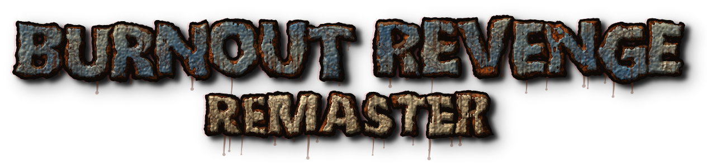

<h1 align="center"></h1>

A native Windows PC port of Burnout Revenge (Xbox 360), built on [Xerenge](https://github.com/shipa-2/Xerenge)
by shipa-2. Bring your own disc. Work in progress.

> **Hi all!** I'm getting the first build ready to ship. It's still being tested, so expect some rough edges.
> I'll post an update here whenever something new comes up.
>
> **Update, 8 Oct 2026:** the one-click installer is built and in final testing (a clean Windows install test
> is running now). The pre-release code review is done and its fixes are in.
>
> Want to know the moment it's out? Click **Watch → Custom → Releases** at the top of this page.
> For now, please use **[Issues](../../issues)** for suggestions, ideas and feedback.

## What this is

- The game recompiled ahead of time to a native Windows executable, with a Vulkan renderer, running at 60 fps.
- PC graphics options in the game's own menus (Driver Details > Settings, and Options in the pause menu), saved
  between runs:
  - render scale: "360" (720 lines), 75%, 100%, 125%, 150% or 200% of the window
  - anti-aliasing: TAA or SMAA; ambient occlusion (GTAO) with its radius; texture filtering up to 16x
  - HD textures, texture sharpness, mipmaps, sharper reflections (2x or 4x)
  - the game's own bloom (full down to off in 25% steps), extra bloom, sharpen, contrast, shadow lift, colour,
    dither, and the takedown music volume
- Rendering fixes (vertex/index handling, texture sampling, explosions, the HUD drawn on its own layer so the
  post-processing never smears it) and frame-pacing work.
- A one-click installer (built, in final testing): it builds everything from **your own** disc image (EU or US)
  on your PC.

**No game files are or will be in this repository, and no Xerenge code either** - only this project's own
patches, scripts, tools and docs. Much of this work was done with AI assistance (Claude); if you would rather not
use AI-assisted projects, that is completely fair.

## Other Burnout Revenge ports

This is not the first PC port of Burnout Revenge, and it doesn't claim to be:

- **[Xerenge](https://github.com/shipa-2/Xerenge)** by shipa-2 - the recompilation this project is built on
  (Linux, with its own installer).
- **[Xbox360-Native-Ports](https://github.com/CrownParkComputing/Xbox360-Native-Ports)** by CrownParkComputing -
  recompiled launchers for several Xbox 360 games, Burnout Revenge (USA) among them, for Linux and Windows.

What this project adds on top of Xerenge: a native Windows build, the PC graphics options above, rendering and
frame-pacing fixes, EU and US discs, and a one-click Windows installer that builds the game from your own disc.

## Status

Not released yet: the installer is in final testing. Plan, progress and credits: **[ROADMAP.md](ROADMAP.md)**.

Showcase video: https://www.youtube.com/watch?v=fSw0UY89H58

## Licence

This project's own code is under the [MIT Licence](LICENSE). Third-party parts keep their own licences (see the
credits in [ROADMAP.md](ROADMAP.md)).

Burnout and Burnout Revenge are trademarks of Electronic Arts. This project is not affiliated with or endorsed by
Electronic Arts or Criterion Games, and contains no game files.
